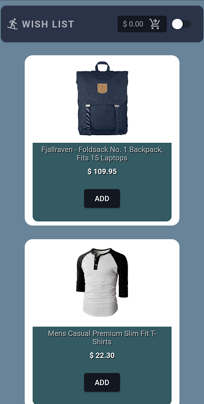
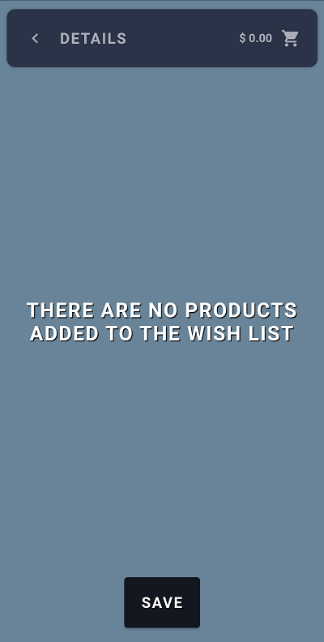
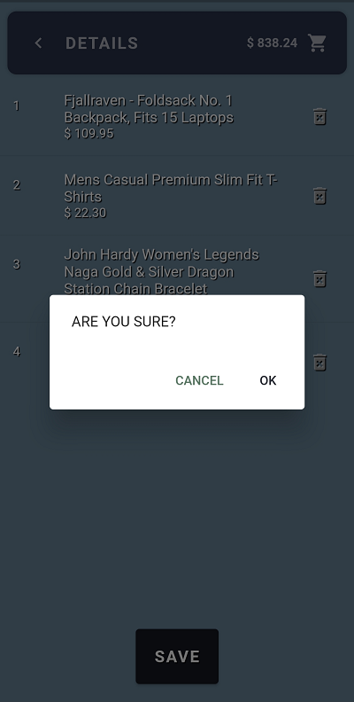
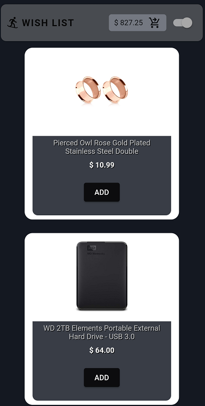
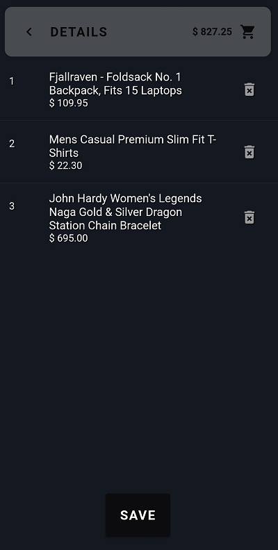
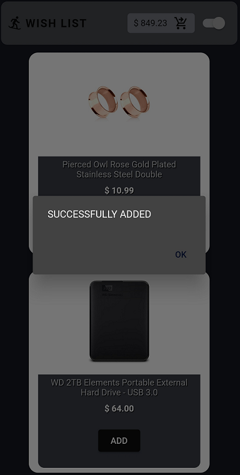

# **Wish list - Lista de deseos**

* Lenguaje de programación: [Dart 2.18.5](https://dart.dev/)

* SDK: [Flutter 3.3.9](https://flutter.dev/)

* API: [Fake Store API](https://fakestoreapi.com/)

## Paquetes usados

* [Shared preferences 2.0.15](https://pub.dev/packages/shared_preferences)

* [Responsive grid list 1.3.0](https://pub.dev/packages/responsive_grid_list)

* [Provider 6.0.4](https://pub.dev/packages/provider)

* [Http 0.13.5](https://pub.dev/packages/http)

## Capturas de pantalla

* Tema claro

     &nbsp;  &nbsp; 

* Tema oscuro

     &nbsp;  &nbsp; 

